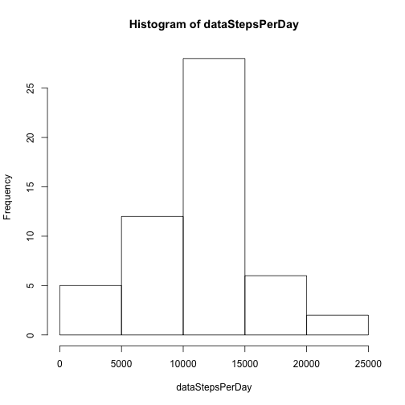
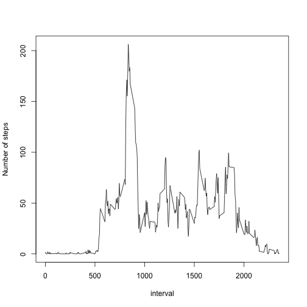
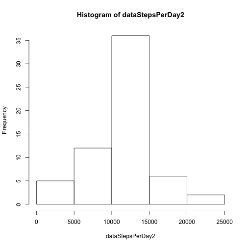
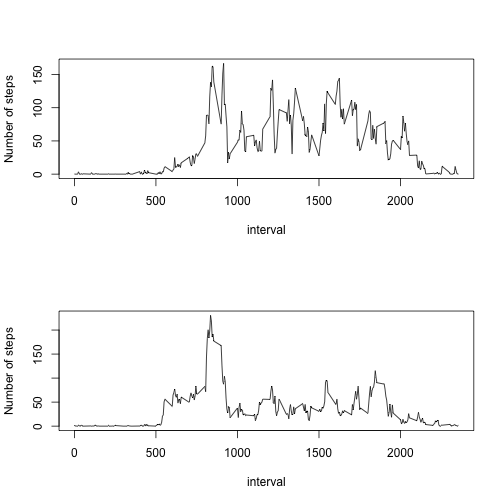

## Loading and preprocessing the data

```r
data <- read.csv('activity.csv')
summary(data)
```

```
##      steps                date          interval     
##  Min.   :  0.00   2012-10-01:  288   Min.   :   0.0  
##  1st Qu.:  0.00   2012-10-02:  288   1st Qu.: 588.8  
##  Median :  0.00   2012-10-03:  288   Median :1177.5  
##  Mean   : 37.38   2012-10-04:  288   Mean   :1177.5  
##  3rd Qu.: 12.00   2012-10-05:  288   3rd Qu.:1766.2  
##  Max.   :806.00   2012-10-06:  288   Max.   :2355.0  
##  NA's   :2304     (Other)   :15840
```

## What is mean total number of steps taken per day?


```r
dataStepsPerDay <- tapply(data$steps,data$date,FUN=sum)
hist(dataStepsPerDay)
```

 

```r
dataStepsPerDay<-dataStepsPerDay[!is.na(dataStepsPerDay)]
mean(dataStepsPerDay)
```

```
## [1] 10766.19
```

```r
median(dataStepsPerDay)
```

```
## [1] 10765
```


## What is the average daily activity pattern?

```r
data2<-data[!is.na(data$steps),]
dataStepsPerInterval = tapply(data2$steps,data2$interval,FUN=mean)
head(dataStepsPerInterval)
```

```
##         0         5        10        15        20        25 
## 1.7169811 0.3396226 0.1320755 0.1509434 0.0754717 2.0943396
```

```r
di<- unique(data$interval)
plot(di,dataStepsPerInterval,type="l",xlab="interval",ylab="Number of steps")
```

 

<br>Which 5-minute interval, on average across all the days in the dataset, contains the maximum number of steps?  


```r
which.max(dataStepsPerInterval)
```

```
## 835 
## 104
```

## Imputing missing values

```r
 dataNA<-data[!complete.cases(data),]
 nrow(dataNA)
```

```
## [1] 2304
```

Fill in the missing values:


```r
data1<-data[complete.cases(data),]
data2=tapply(data1$steps,data1$interval,FUN=mean)
dataComplete<-data
for(i in 1:nrow(dataComplete))
{
    if(is.na(dataComplete[i,'steps']))
    {  
        inv<-dataComplete[i,'interval']
        dataComplete[i,'steps']<-as.integer(data2[as.character(inv)])
    }
}
dataStepsPerDay2 <- tapply(dataComplete$steps,dataComplete$date,FUN=sum)
hist(dataStepsPerDay2)
```

 

```r
mean(dataStepsPerDay2)
```

```
## [1] 10749.77
```

```r
median(dataStepsPerDay2)
```

```
## [1] 10641
```

## Are there differences in activity patterns between weekdays and weekends?

```r
dataComplete$wdtype<-c("weekday","weekend")
for(i in 1:nrow(dataComplete))
{
    #wd<-weekdays(as.Date(dataComplete[i,'date']))
    #weekdays is locale awear which is not better enough
    wd<-as.POSIXlt(as.Date(dataComplete[i,'date']))
    if(wd$wday %in% c(0,6))
    {  
      dataComplete[i,"wdtype"]<-'weekend'
    }
    else{
      dataComplete[i,"wdtype"]<-'weekday'  
    } 
}
par(mfrow=c(2,1))
dataWeekEnd=dataComplete[dataComplete$wdtype=='weekend',]
dataWeekDay=dataComplete[dataComplete$wdtype=='weekday',]
dataWeekEndSum<-tapply(dataWeekEnd$steps,dataWeekEnd$interval,FUN=mean)
dataWeekDaySum<-tapply(dataWeekDay$steps,dataWeekDay$interval,FUN=mean)
plot(unique(dataWeekEnd$interval),dataWeekEndSum,type="l",xlab="interval",ylab="Number of steps")
plot(unique(dataWeekDay$interval),dataWeekDaySum,type="l",xlab="interval",ylab="Number of steps")
```

 

```r
dev.off()
```

```
## null device 
##           1
```
